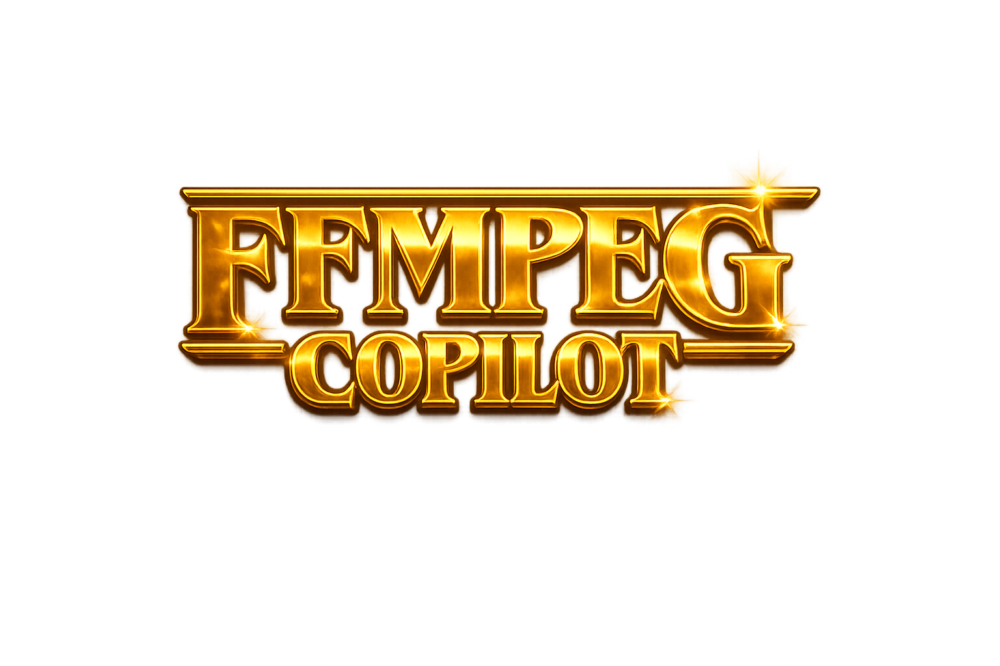

<p align="center">
  
</p>

<p align="center">
  <b>FFmpeg, but Sexy!</b><br/>
  <i>An AI-powered desktop app that converts natural language into FFmpeg commands and executes them — no terminal needed.</i>
</p>

<p align="center">
  
  
  
  
  
</p>

---

## ✨ What is FFmpeg Copilot?

**FFmpeg Copilot** is a sleek, glassmorphic desktop application that lets you manipulate media files using **plain English**. Just drag-and-drop your files, describe what you want, and the AI takes care of generating and running the correct FFmpeg command.

No more memorizing complex FFmpeg flags. No more copy-pasting from Stack Overflow.

---

## 🎬 Features

| Feature | Description |
|---|---|
| 🧠 **AI-Powered** | Uses Groq LLM API to translate natural language → FFmpeg commands |
| 📁 **Drag & Drop** | Drop any media file directly into the app |
| 🎛️ **Model Selector** | Choose between free & premium LLM models |
| 🖥️ **Live Terminal** | Watch FFmpeg execute in real-time with a built-in terminal |
| 🖼️ **Output Gallery** | Browse all your processed files with previews |
| 🔐 **Secure API Key** | Keys stored securely via OS keychain (keytar) |
| 🎨 **Stunning UI** | Glassmorphism, animated borders, grid warp effects |
| 📂 **One-Click Open** | Open output file location directly from the app |

---

## 🚀 Quick Start (Using the Installer)

The easiest way to use FFmpeg Copilot — **no coding required**.

### Prerequisites

- **FFmpeg** must be installed and available on your system `PATH`.  
  👉 [Download FFmpeg](https://ffmpeg.org/download.html) or install via:
  ```bash
  # Windows (using winget)
  winget install FFmpeg

  # Windows (using choco)
  choco install ffmpeg
  ```

### Install

1. Go to the [**Releases**](https://github.com/ayush-patel-29/ffmpeg_copilot/releases) page.
2. Download the latest `.exe` installer (Setup file).
3. Run the installer — it will set up everything automatically.
4. Launch **FFmpeg Copilot** from your Start Menu or Desktop shortcut.

### Setup your API Key

1. Click the **👤 Account** button in the top-right corner.
2. Enter your **Groq API Key** ([Get one free here](https://console.groq.com/keys)).
3. You're ready to go!

---

## 🛠️ Development Setup (Build from Source)

If you want to run or modify the source code yourself:

### Prerequisites

- [**Node.js**](https://nodejs.org/) v18+ (LTS recommended)
- [**FFmpeg**](https://ffmpeg.org/download.html) installed and on your `PATH`
- A [**Groq API Key**](https://console.groq.com/keys)

### Steps

```bash
# 1. Clone the repository
git clone https://github.com/ayush-patel-29/ffmpeg_copilot.git
cd ffmpeg_copilot

# 2. Install dependencies
npm install

# 3. Start the app in development mode
npm start
```

The app will open in an Electron window with hot-reload enabled.

---

## 📦 Building the Executable

To create a distributable `.exe` installer:

```bash
# Package the app (creates unpacked output in ./out/)
npm run package

# Create the installer (.exe for Windows)
npm run make
```

The installer will be generated inside the `out/make/` directory.

---

## 🗂️ Project Structure

```
ffmpeg_copilot/
├── src/
│   ├── main.js              # Electron main process
│   ├── preload.js            # Context bridge (IPC)
│   ├── renderer.js           # Renderer entry point
│   ├── app.jsx               # Main React UI component
│   ├── auth.js               # Secure API key storage (keytar)
│   ├── ffmpegExecutor.js     # FFmpeg process spawner
│   ├── index.css             # Global styles & animations
│   ├── services/
│   │   └── groqClient.js     # Groq LLM integration
│   ├── components/
│   │   ├── SettingsModal.jsx  # API key settings modal
│   │   ├── GalleryModal.jsx   # Output files gallery
│   │   └── GridWarpEffect.jsx # Interactive grid animation
│   ├── assets/               # Logo and images
│   ├── fonts/                # Custom fonts
│   └── utils/
│       └── constants.js      # App constants & model list
├── forge.config.js           # Electron Forge build config
├── webpack.main.config.js    # Webpack config (main process)
├── webpack.renderer.config.js# Webpack config (renderer)
├── webpack.rules.js          # Webpack loaders
├── package.json
└── README.md
```

---

## 🔑 How It Works

```
┌─────────────┐     ┌──────────────┐     ┌──────────────┐     ┌──────────────┐
│  User drops  │────▶│  Writes a    │────▶│  Groq LLM    │────▶│  FFmpeg runs │
│  media file  │     │  prompt      │     │  generates   │     │  the command │
│              │     │              │     │  FFmpeg JSON │     │              │
└─────────────┘     └──────────────┘     └──────────────┘     └──────────────┘
                                                                      │
                                                                      ▼
                                                              ┌──────────────┐
                                                              │  Output file │
                                                              │  saved to    │
                                                              │  gallery     │
                                                              └──────────────┘
```

1. **Drop** your media files (video, audio, images) into the app.
2. **Describe** what you want in plain English (e.g., *"Convert to MP3"*, *"Trim from 0:30 to 1:00"*, *"Add watermark"*).
3. The app sends your prompt + file info to **Groq's LLM API**.
4. The LLM returns a structured **FFmpeg command** as JSON.
5. FFmpeg Copilot **executes** the command and shows live terminal output.
6. Your processed file appears in the **output gallery** — click to open the folder.

---

## 📋 Example Prompts

| Prompt | What it does |
|---|---|
| `Convert this to MP3` | Extracts audio from video |
| `Resize to 720p` | Scales video to 1280×720 |
| `Trim from 00:30 to 01:15` | Cuts a specific segment |
| `Remove audio` | Strips the audio track |
| `Compress this video` | Reduces file size with optimized encoding |
| `Extract frames as PNG` | Exports video frames as images |
| `Add a fade-in effect` | Adds a smooth fade at the start |

---

## ⚙️ Configuration

| Setting | Location | Description |
|---|---|---|
| **API Key** | In-app Settings (👤) | Stored securely in OS keychain |
| **LLM Model** | Model dropdown (bottom-right of prompt) | Switch between free/paid models |
| **Output Directory** | `C:/ffmpeg_copilot/outputs/` | Where processed files are saved |

---

## 🤝 Contributing

Contributions are welcome! Feel free to:

1. Fork the repository
2. Create a feature branch (`git checkout -b feature/amazing-feature`)
3. Commit your changes (`git commit -m 'Add amazing feature'`)
4. Push to the branch (`git push origin feature/amazing-feature`)
5. Open a Pull Request

---

## 📜 License

This project is licensed under the **MIT License** — see the [LICENSE](LICENSE) file for details.

---

## 👤 Author

**Ayush Patel**  
📧 ayushpatel.org@gmail.com  
🔗 [GitHub — @ayush-patel-29](https://github.com/ayush-patel-29)

---

<p align="center">
  <i>Made with ❤️ and a lot of FFmpeg docs</i>
</p>
